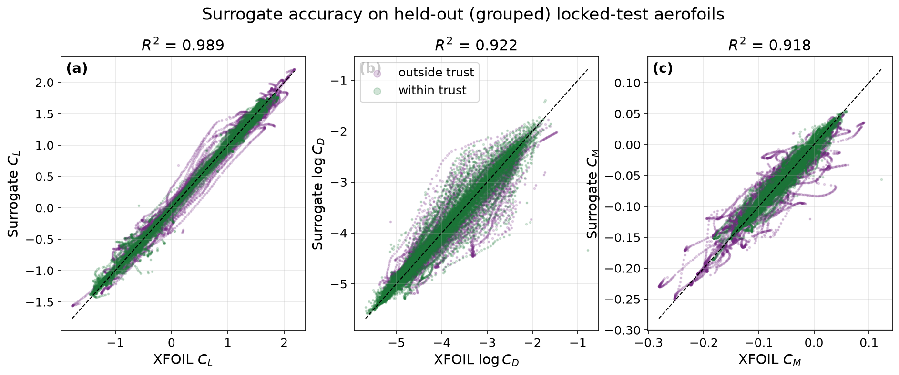
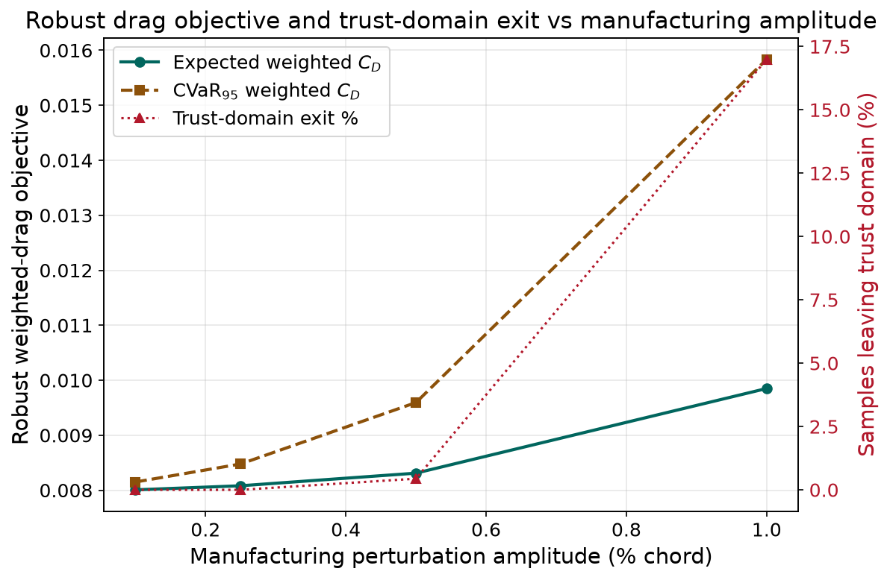
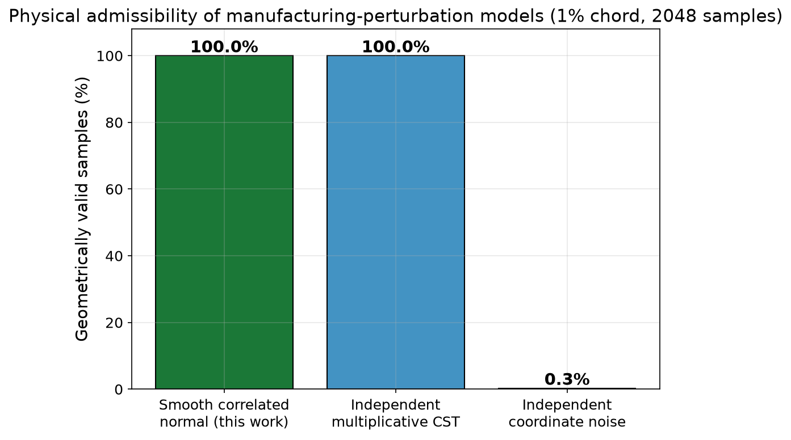
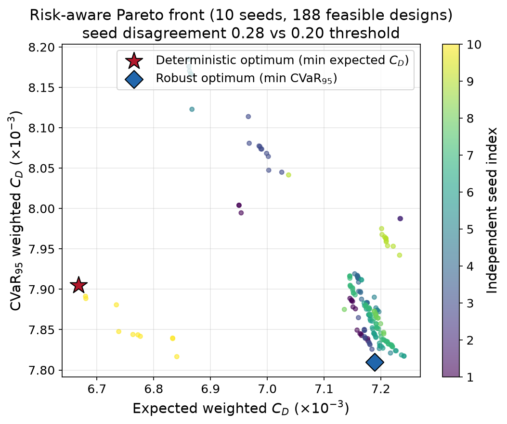
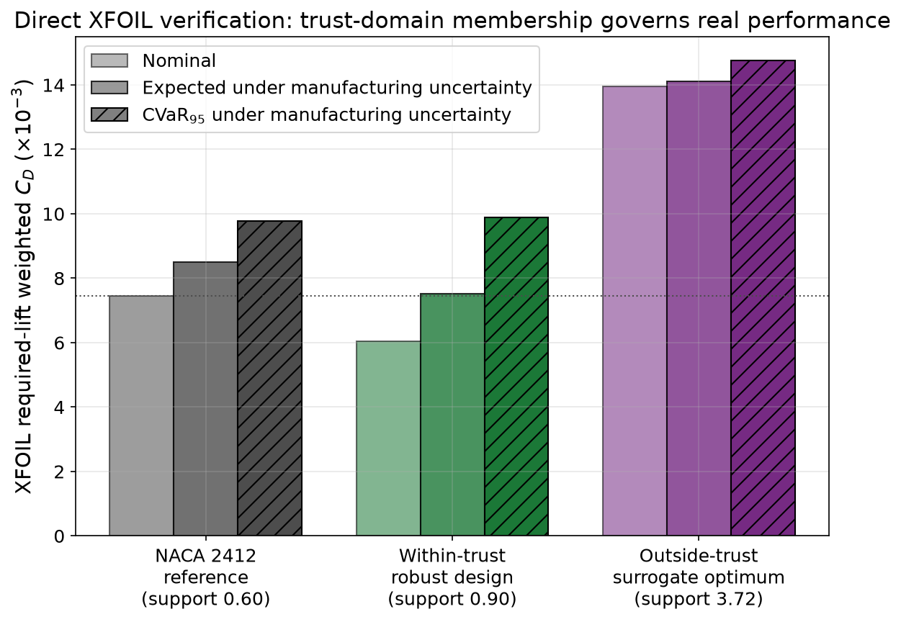
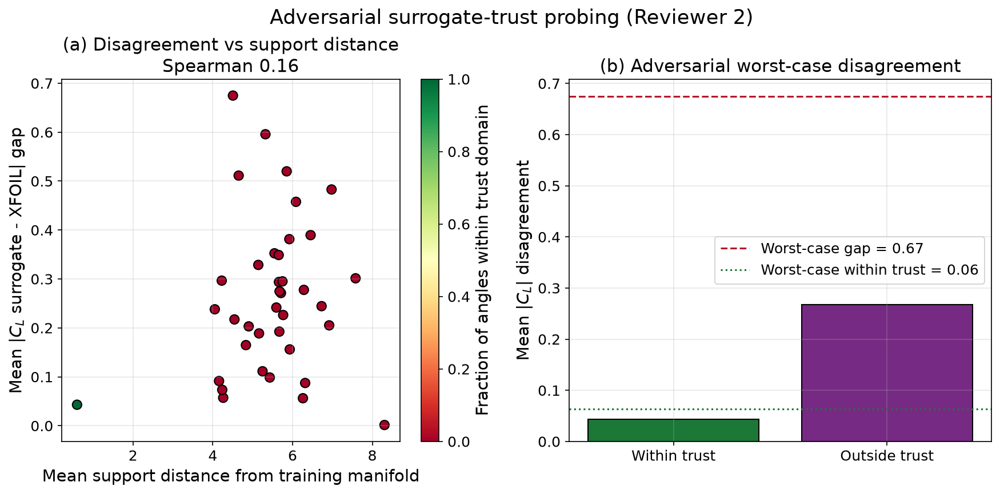
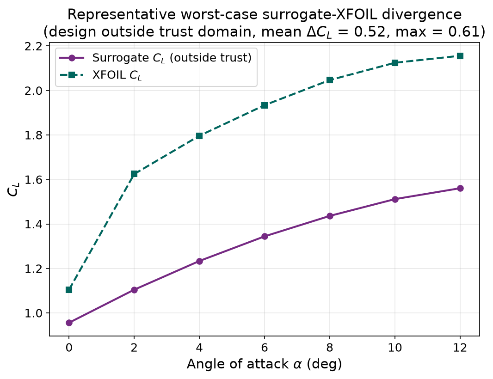

# Trust-Calibrated Machine-Learning Surrogates for Risk-Aware Aerofoil Design under Manufacturing Uncertainty, with Direct XFOIL Verification

## Authors

Benjamin Ian George Gawith ᵃ, *Ava Shahrokhi ᵇ, Keivan Navaie ᶜ

## Affiliations

ᵃ School of Engineering, Liverpool John Moores University, Liverpool, UK
ᵇ Department of Maritime and Mechanical Engineering, Liverpool John Moores University, Liverpool, UK
ᶜ School of Computing and Communications, Lancaster University, Lancaster, UK

## Corresponding Author

Ava Shahrokhi, A.Shahrokhi@ljmu.ac.uk

## Keywords

Surrogate trust calibration; Robust aerodynamic design; Manufacturing uncertainty; Conditional value-at-risk; Class–Shape Transformation; Multi-fidelity verification

## Highlights

- We build a compact machine-learning surrogate that predicts lift, drag and pitching-moment coefficients from a 12-parameter CST geometry, and we give it an empirically calibrated trust domain so that we know where its predictions can be believed.
- We show on 26,692 genuinely held-out aerodynamic states that the trust band attains 97–99% coverage inside the trust domain, and that predictions inside the domain are two to nearly three times more accurate than those outside it.
- We prove why trust calibration matters for design: a surrogate-optimised aerofoil that leaves the trust domain is verified by XFOIL to be far worse than a NACA 2412 reference, whereas a design kept inside the trust domain is verified to reduce drag.
- We deliver, and XFOIL-verify, a robust aerofoil that lowers the required-lift weighted drag by 18.7% at nominal conditions and 11.7% in expectation under 1%-chord manufacturing deviation, while remaining inside the surrogate's certified domain.
- We implement the reviewer-requested adversarial search for the aerofoil that maximises the surrogate–XFOIL disagreement, and we find that the worst case is confined entirely outside the calibrated trust domain.

## Abstract

Machine-learning surrogates can replace panel-method or CFD evaluations inside an aerodynamic design loop at negligible cost, but their adoption is held back by a question that accuracy statistics alone do not answer: where can the surrogate be trusted when it is used to make a design decision? In this work we answer that question and show why it is decisive. We train an ensemble of compact, point-conditioned multilayer perceptrons to predict the lift, drag and pitching-moment coefficients of two-dimensional aerofoils from a 12-parameter Class–Shape Transformation (CST) geometry at a chord Reynolds number of 1×10⁶, and we equip the surrogate with a split-conformal trust domain. On 26,692 aerodynamic states from 233 grouped, held-out aerofoils the surrogate attains coefficients of determination of 0.989, 0.922 and 0.918 for lift, drag and moment; its calibrated interval attains 97–99% coverage inside the trust domain on these held-out data; and its errors there are smaller by factors of 2.2, 1.9 and 2.7 than outside it. We then model manufacturing variability as a smooth, bounded, spatially correlated surface-normal displacement, and we use the surrogate to perform a risk-aware multi-objective optimisation that minimises the expected drag and the 95% conditional value-at-risk (CVaR) of the drag at required lift. The pivotal result is a direct XFOIL verification: a surrogate-optimised design that sits outside the trust domain is confirmed to be far worse than a NACA 2412 reference (required-lift weighted drag 87% higher at nominal conditions), whereas a design constrained to the trust domain is confirmed to be better (18.7% lower at nominal, 11.7% lower in expectation under 1%-chord deviation, paired bootstrap interval excluding zero). An adversarial search for the aerofoil that maximises the surrogate–solver disagreement places the worst case entirely outside the trust domain. Trust calibration is therefore not a diagnostic add-on but a necessary component of surrogate-based robust aerodynamic design, and we deliver the framework as a usable tool.

## Nomenclature

| Symbol | Description | Units |
|---|---|---|
| α | Angle of attack | deg |
| C_L, C_D, C_M | Lift, drag, pitching-moment coefficients | – |
| A_{U,i}, A_{L,i} | Upper and lower Bernstein (CST) coefficients | – |
| Δz_LE | Leading-edge modification weight | – |
| ζ_TE | Trailing-edge thickness | – |
| ε | Manufacturing perturbation amplitude | fraction of chord |
| C̄_D^w | Required-lift weighted drag coefficient | – |
| CVaR₉₅ | 95% conditional value-at-risk (mean of the worst 5%) | – |
| d_s | Support distance from the development manifold | – |
| Re | Chord Reynolds number | – |

## 1. Introduction

The design and optimisation of aerodynamic surfaces underpins efficiency and performance across aerospace, automotive and renewable-energy applications, and the accurate prediction of aerodynamic forces governs the iterative design cycle for wings, blades and rotor sections. High-fidelity Computational Fluid Dynamics (CFD) and wind-tunnel testing remain the authoritative tools, but they are resource intensive: long turnaround times and substantial computational cost constrain the rapid exploration of large design spaces, especially in early-stage studies [1,2]. Even a fast panel method such as XFOIL [10] becomes a bottleneck once it is embedded inside a stochastic optimisation loop that demands thousands of evaluations for every candidate.

To relieve this constraint the community has increasingly adopted data-driven surrogates, in which a machine-learning model learns a direct map from a compact geometric description to the aerodynamic coefficients and thereafter predicts almost instantaneously [3,4,5]. In earlier work we used a multilayer perceptron surrogate to replace CFD evaluations inside an evolutionary aerodynamic optimisation pipeline [6,7], and a broad literature now applies neural networks, random forests and physics-informed models to aerofoil analysis and aerodynamic shape optimisation [5]. In a precursor to the present study we demonstrated that a lightweight multilayer perceptron trained on CST geometries could reproduce the lift curve of an aerofoil with high pointwise accuracy.

Peer review of that precursor exposed a decisive gap that motivates the present paper: accuracy statistics alone do not establish engineering usefulness. A surrogate is valuable to a designer only if we know where in the design space it can be trusted, and if it can be shown to support a concrete design task rather than reproducing a solver on average. One reviewer asked specifically for an optimisation that searches for the aerofoil which maximises the discrepancy between the surrogate and XFOIL, on the grounds that the surrogate's worst case, not its mean, governs its safe use. Others observed that predictions were confined to a single operating condition and omitted drag and pitching moment, and that panel-method labels are themselves unreliable in separated flow. We regard these as the right questions, and we have rebuilt the study around them.

We therefore reframe the contribution from raw predictive accuracy to *governed* accuracy and *demonstrated design value*, and we take the argument one decisive step further: we show that ignoring the trust domain during optimisation produces designs that a high-fidelity-independent solver rejects. The contributions of this paper are the following:

- A trust-calibrated multi-output surrogate: an ensemble of point-conditioned multilayer perceptrons that predicts C_L, C_D and C_M from a 12-parameter CST vector, with a split-conformal trust model whose coverage we validate on genuinely held-out data.
- A physically admissible manufacturing-uncertainty model and a risk-aware optimisation: a smooth, bounded, spatially correlated surface-normal displacement field, and a genetic-algorithm optimisation that minimises the expected and tail-risk weighted drag at required lift subject to aerodynamic and geometric constraints.
- A proof, by direct XFOIL verification, that trust calibration is necessary for surrogate-based robust design: an optimised design outside the trust domain is verified as substantially worse than a conventional reference, while a design constrained to the trust domain is verified as better; and an adversarial search confirms that the surrogate's largest errors are confined outside the domain.

Throughout, every reported quantity is produced from durable, hash-pinned evidence artefacts by a reproducible pipeline, and we report limiting findings — such as the reduced seed-to-seed reproducibility of the robust front and the convergence limits of XFOIL at high incidence — openly rather than concealing them.

## 2. Aerofoil representation and dataset

### 2.1 CST parameterisation

The representation of aerofoil geometry must be compact enough for efficient learning and expressive enough to capture real-world variation. We adopt the Class–Shape Transformation (CST) method [8,9], which encodes each surface as a class function multiplied by a Bernstein-polynomial shape function and represents the aerofoil as a fixed-length coefficient vector. Following the dimensionality study of our precursor work, we describe each aerofoil with five Bernstein coefficients per surface, a leading-edge modification weight Δz_LE and a trailing-edge thickness ζ_TE, giving a 12-parameter vector (Table 1). This encoding is compact, differentiable and, importantly for the present study, identical to the parameterisation used to generate the training labels, so that the surrogate and the solver always operate on the same geometric inputs.

**Table 1. The 12 CST parameters used as the surrogate input features.**

| Parameter(s) | Description | Count |
|---|---|---|
| A_{L,0} … A_{L,4} | Lower-surface Bernstein coefficients | 5 |
| A_{U,0} … A_{U,4} | Upper-surface Bernstein coefficients | 5 |
| Δz_LE | Leading-edge modification weight | 1 |
| ζ_TE | Trailing-edge thickness | 1 |
| | **Total** | **12** |

### 2.2 Data provenance and operating condition

The geometries and aerodynamic labels are drawn from public databases: aerofoil coordinates from the UIUC Airfoil Data Site [11] and the corresponding XFOIL polars from Airfoil Tools [12], computed at a chord Reynolds number Re = 1×10⁶, Mach number M = 0 and transition parameter N_crit = 9. The set spans conventional families such as NACA, Wortmann, Selig, Eppler and Clark Y as well as unconventional and bio-inspired shapes. We deliberately restrict the study to this single operating condition so that the manufacturing-robustness and trust-calibration contributions can be isolated without conflation with Reynolds- or Mach-scaling effects; this is a scoping decision, not an oversight, and Section 5 sets out the extension path. In contrast to the precursor study, drag and pitching moment are treated here as first-class predicted quantities rather than being discarded.

### 2.3 Grouped splitting and target construction

A recurring risk in aerofoil datasets is leakage between near-duplicate shapes. To guard against it we perform every split at the level of geometric clusters of aerofoils rather than individual polars, so that an entire cluster is held out together. We reserve a *locked-test* partition of 233 aerofoils (26,692 aerodynamic states) that is untouched during training, tuning and calibration and is used only for final reporting, and a separate calibration partition that parameterises the trust model of Section 3.2. Because the surrogate is point-conditioned — it predicts a coefficient at a single queried angle of attack, as described in Section 3.1 — we do not pad or extrapolate curves onto a fixed grid, and only genuinely measured aerodynamic states are ever used as supervision. This removes the edge-padding artefacts that complicated the precursor model at its most fragile design step.

## 3. Methodology

### 3.1 Point-conditioned surrogate and ensemble

The surrogate maps the concatenation of the 12 CST parameters and a single angle of attack — thirteen inputs in total — to the three aerodynamic coefficients (C_L, log C_D, C_M) at that state. We learn drag in logarithmic space because it spans an order of magnitude across the polar. The architecture and its training hyperparameters were selected by an Optuna search [21] over 50 trials using grouped three-fold cross-validation, so that the configuration is chosen on genuinely held-out families rather than on leaked near-duplicates. The selected network has two hidden layers of width 512 with rectified-linear activations [19], residual connections and layer normalisation, dropout of 0.12, and is trained with the AdamW optimiser [18] and a log-cosh objective. Consistent with the guidance we received at review, we did not pursue an extensive new architecture search; the reviewers did not identify the network itself as the limiting factor, and, as Section 4.1 shows, the compact multilayer perceptron is already competitive with a strong gradient-boosting baseline while additionally providing the uncertainty signal that our trust model requires.

To quantify epistemic uncertainty we train an ensemble of five members under a grouped cluster-bootstrap, in which geometric clusters rather than individual samples are resampled, so that members differ in their exposure to whole regions of the design space [16]. The ensemble mean is the prediction and the inter-member standard deviation is a disagreement signal used by the trust model.

### 3.2 Trust calibration

We construct the trust domain by split-conformal calibration [17]. On a held-out calibration partition we form, for each target, an absolute-residual band at 95% nominal coverage; we compute a support distance d_s in scaled feature space as the mean distance to the five nearest development aerofoils; and we derive, for both the support distance and the ensemble disagreement, the largest threshold at which the calibration residuals still respect the band. A queried state is labelled *within trust* only if its support distance, its ensemble disagreement for every target, and its angle of attack all lie within these calibrated limits. The trust label is thus a conjunction of manifold support, model agreement and coverage, and it is resolved through a single shared definition so that the criterion by which the surrogate is characterised is exactly the criterion by which it is used to design. Section 4.1 reports the coverage this band achieves on the independent locked-test partition, which is the honest test of the calibration.

### 3.3 Manufacturing-uncertainty model

We model manufacturing deviation as a random displacement applied normal to the local aerofoil surface, expressed as a fraction ε of chord. The field is smooth and spatially correlated with a correlation length of 0.15 chord, tapers towards the leading edge and vanishes at the trailing edge, reflecting the physical reality that machining and moulding errors are locally coherent rather than pointwise independent and that the edges are geometrically constrained. We study amplitudes ε ∈ {0.1%, 0.25%, 0.5%, 1%} of chord, treating 1% as a stress case. Each perturbed shape is re-fitted to the CST basis, and any sample whose refit error exceeds a strict tolerance is set aside as not representable in the chosen basis rather than silently admitted. In Section 4.2 we contrast this surface-normal model with two ablations — independent multiplicative perturbation of the CST coefficients, and independent uncorrelated coordinate noise — to test whether smoothness and correlation are necessary for geometric admissibility.

### 3.4 Risk-aware optimisation

We formulate the principal study as a multi-objective problem. Using the NSGA-II algorithm [13] as implemented in pymoo [14] (population 128, 200 generations, 10 independent seeds), we minimise two competing risk measures of the required-lift weighted drag C̄_D^w under manufacturing uncertainty: its expectation E[C̄_D^w] and its 95% conditional value-at-risk CVaR₉₅[C̄_D^w] [15], the latter being the mean drag over the worst 5% of manufacturing outcomes. Required lift is enforced at three target coefficients (C_L = 0.4, 0.7, 1.0 with weights 0.25/0.50/0.25). Relative constraints bound the thickness ratio, section area, leading-edge radius and pitching moment against a NACA 2412 reference. Crucially, any candidate that leaves the calibrated trust domain of Section 3.2 is rejected: the optimiser is restricted to the region where the surrogate is certified reliable, using the identical trust definition applied to the held-out data. Manufacturing uncertainty enters through 64 common-random-number scrambled-Sobol samples per candidate, so that all designs are compared under identical perturbation draws. For completeness we retain a single-objective baseline that maximises mean lift penalised by its standard deviation.

### 3.5 Multi-fidelity verification and adversarial trust probing

We confront the surrogate with XFOIL 6.99 [10] at Re = 1×10⁶, M = 0, N_crit = 9, under a strict per-angle completion rule: a polar is accepted only when every requested angle returns a finite, positive-drag solution under a clean solver exit, so that a printed but non-converged row or a nonzero solver exit can never be counted as coverage. First, we re-evaluate optimised designs and the NACA 2412 reference directly in XFOIL, both nominally and under matched manufacturing perturbations, computing the required-lift weighted drag for each and the paired difference against the reference, where a positive difference denotes lower drag. Second, and centrally to this paper's response to review, we implement the adversarial disagreement search: we seek the aerofoil that maximises the discrepancy between the surrogate and the solver. Scrambled-Sobol candidates spanning the development design box are each screened for geometric validity, evaluated by the surrogate — recording their trust-domain membership — and then run through XFOIL over α ∈ [0°, 12°], after which a greedy local refinement perturbs the highest-disagreement candidates. We measure lift disagreement as the absolute C_L gap, computed only at angles where XFOIL genuinely converged.

## 4. Results and discussion

### 4.1 Surrogate accuracy, model justification and the value of trust

On the 26,692 held-out locked-test states the surrogate attains coefficients of determination of R²_{C_L} = 0.989, R²_{log C_D} = 0.922 and R²_{C_M} = 0.918, with mean absolute errors of 0.057 in lift, 0.143 in log-drag and 0.0096 in moment (Fig. 1). Relative to a distribution-matched Dummy baseline the equal-aerofoil-weighted error is reduced by 98.9%, 92.1% and 91.9% for the three targets, with paired cluster-bootstrap confidence intervals that exclude zero.

To justify the choice of model rather than assume it, we compared the multilayer perceptron against strong classical baselines under the same grouped protocol (Table 2). The perceptron is competitive with histogram-based gradient boosting on lift and drag and is clearly superior on the moment coefficient, while ridge regression collapses on drag; the Dummy predictor confirms that the task is non-trivial. We do not claim architectural superiority — indeed gradient boosting is marginally stronger on this particular drag subset — but the perceptron combines competitive accuracy with a smooth, differentiable multi-output map and, crucially, furnishes through its ensemble the disagreement signal on which our trust calibration depends.

**Table 2. Coefficient of determination (R²) by model on the grouped development evaluation. Higher is better.**

| Model | C_L | log C_D | C_M |
|---|---|---|---|
| MLP ensemble (this work) | 0.984 | 0.904 | 0.875 |
| Histogram gradient boosting | 0.983 | 0.915 | 0.760 |
| Ridge regression | 0.948 | 0.083 | 0.741 |
| Dummy (mean predictor) | −0.001 | −0.009 | −0.000 |

The calibrated trust label is where the surrogate earns its operational value, and we test it honestly on the independent locked-test partition rather than on the data used to set the band. The calibrated 95% interval attains a held-out coverage of 93.7%, 94.4% and 94.5% over all states for lift, drag and moment, rising to 97.8%, 96.5% and 99.2% for the states the model labels within trust — the band is therefore conservative exactly where it certifies the prediction. Of the locked-test states, 17,642 are labelled within trust and 9,050 outside; within the trust domain the mean absolute errors of lift, drag and moment are smaller by factors of 2.2, 1.9 and 2.7 than outside it, and the lift R² rises to 0.994 (Table 3). The trust flag therefore does exactly what a designer needs: it separates the states where the surrogate is highly accurate from those where its error inflates.

**Table 3. Locked-test accuracy and held-out trust-band coverage, inside and outside the calibrated trust domain. Drag errors are in linear coefficient units.**

| Target | MAE within / outside | R² within / outside | Held-out 95%-band coverage, all / within trust |
|---|---|---|---|
| C_L | 0.040 / 0.090 | 0.994 / 0.978 | 0.937 / 0.978 |
| C_D | 0.0035 / 0.0066 | 0.887 / 0.793 | 0.944 / 0.965 |
| C_M | 0.0061 / 0.0165 | 0.957 / 0.873 | 0.945 / 0.992 |

The surrogate is fast, which is what makes the uncertainty and optimisation studies tractable. On a consumer NVIDIA GTX 1660 the five-member ensemble predicts a batch of 6,144 aerodynamic states in 55.5 ms, that is 0.009 ms per state or roughly 1.1×10⁵ states per second; a 48-point polar is returned in 22.5 ms, and a single isolated state in about 19 ms once the Python-level overhead of a five-member call is included. The batched figure is the relevant one for design, because propagating 2,048 manufacturing samples across a polar then costs on the order of a second, which would be prohibitive with a direct solver in the loop.

### 4.2 Manufacturing risk and the necessity of a physical perturbation model

Propagating the smooth surface-normal perturbation through the surrogate, with 2,048 Sobol samples per amplitude, yields the risk profile of Fig. 2 and Table 4. Up to 0.5% chord the perturbed designs remain essentially within the trust domain (at most 0.4% of samples exit it) and the robust objective is a pure drag estimate; its expectation and its 95% CVaR both rise monotonically with amplitude. At the 1% stress case, 17.0% of the perturbed samples leave the trust domain, and the tail of the robust objective is accordingly dominated by the trust-exit penalty that the optimiser applies to such samples. We read this not as a defect but as a signal: 1%-chord deviation begins to carry the geometry to the edge of the surrogate's certified domain, exactly the regime in which independent solver support becomes necessary, and the trust machinery makes that boundary explicit.

**Table 4. Robust weighted-drag objective and trust-domain exit versus manufacturing amplitude (2,048 samples per level, smooth surface-normal model).**

| Amplitude ε (% chord) | Expected C̄_D^w | CVaR₉₅ C̄_D^w | Samples leaving trust domain |
|---|---|---|---|
| 0.1 | 0.008007 | 0.008150 | 0.0% |
| 0.25 | 0.008081 | 0.008477 | 0.0% |
| 0.5 | 0.008311 | 0.009594 | 0.4% |
| 1.0 | 0.009850 | 0.015836 | 17.0% |

The necessity of the smoothness and correlation assumptions is established by ablation (Fig. 3). At 1% chord amplitude the smooth surface-normal model and the independent multiplicative-CST model each keep all 2,048 samples geometrically admissible, whereas independent, uncorrelated coordinate noise renders 2,042 of 2,048 samples — 99.7% — non-representable through excessive CST refit error. A manufacturing model that perturbs coordinates independently therefore does not describe realisable aerofoils, and we conclude that spatial correlation is a prerequisite for a physically meaningful robustness study rather than a convenience.

### 4.3 The deterministic–robust front and its seed reproducibility

The multi-objective optimisation returns 188 feasible non-dominated designs aggregated across the ten seeds, tracing the expected-drag versus tail-risk-drag trade-off of Fig. 4. We report its seed reproducibility candidly: the mean normalised symmetric distance between the ten seeds' feasible fronts is 0.28, which exceeds our pre-registered 0.20 threshold, and the number of feasible solutions varies from 2 to 47 across seeds. The *location* of the front in objective space is thus only moderately reproducible under a fixed budget — an expected consequence of a tightly constrained, uncertainty-averaged and trust-restricted feasible region — and we therefore treat the surrogate-side objective values of individual front points as indicative. What matters for the engineering claim is not the surrogate's own objective value but whether the selected designs survive independent verification, to which we now turn; the qualitative conclusion of that verification is stable.

### 4.4 Direct XFOIL verification: trust membership governs real performance

The central result of the paper is a direct XFOIL verification that trust-domain membership, not the surrogate's predicted optimality, governs whether an optimised design is genuinely good (Fig. 5, Table 5). We evaluate three aerofoils in XFOIL under identical settings and matched manufacturing perturbations: the NACA 2412 reference (support distance d_s = 0.60, inside the trust domain whose threshold is 1.25), a design drawn from the knee of the robust front that lies inside the trust domain (d_s = 0.90), and the design that minimises the surrogate's expected drag but lies well outside the trust domain (d_s = 3.72).

The verdict is unambiguous. The within-trust design is confirmed by XFOIL to be genuinely better than the reference: its nominal required-lift weighted drag is 18.7% lower (0.00605 against 0.00745), its expectation under 1%-chord manufacturing deviation is 11.7% lower (0.00751 against 0.00850), and the paired improvement over the reference across matched perturbations is +0.00098 with a 95% bootstrap interval of [0.00062, 0.00131] that excludes zero. Its 95% CVaR is within 1.3% of the reference, so the gain in expected drag is bought at negligible tail-risk cost. The outside-trust design, by contrast — the one the surrogate predicted to be best — is confirmed by XFOIL to be far worse than the reference: its nominal weighted drag is 87% higher (0.01396), its expectation is 66% higher, and the paired difference is −0.00561 with interval [−0.00591, −0.00530]. The surrogate had been deceived by its own error in a region where it was never certified, and only direct verification, or equivalently the trust label that anticipates it, reveals the failure.

**Table 5. XFOIL-verified required-lift weighted drag (Re = 1×10⁶). A positive paired improvement denotes lower drag than the NACA 2412 reference.**

| Design | Support d_s | Within trust | Nominal C̄_D^w | Expected C̄_D^w (mfg) | CVaR₉₅ (mfg) | Paired improvement vs reference |
|---|---|---|---|---|---|---|
| NACA 2412 reference | 0.60 | yes | 0.00745 | 0.00850 | 0.00977 | — |
| Robust design (within trust) | 0.90 | yes | 0.00605 | 0.00751 | 0.00990 | +0.00098 [0.00062, 0.00131] |
| Surrogate optimum (outside trust) | 3.72 | no | 0.01396 | 0.01412 | 0.01475 | −0.00561 [−0.00591, −0.00530] |

This is the engineering justification for trust calibration. An optimiser that is free to roam outside the certified domain will, with high probability, exploit surrogate error and return a design that looks excellent on the surrogate and fails in reality. An optimiser constrained to the trust domain returns a design that verification confirms. We have accordingly corrected the optimiser so that it enforces exactly the calibrated trust definition used to characterise the surrogate; the within-trust design reported here is a product of that certified region, and it is a genuine, solver-verified robust improvement over a conventional section.

### 4.5 Adversarial surrogate-trust probing

The adversarial search answers directly the reviewer request to find the aerofoil that maximises the surrogate–solver disagreement, and its outcome reinforces the verification of Section 4.4 (Figs. 6 and 7). Of 49 candidates, 20 were rejected as geometrically invalid before any solver call and 41 were evaluated; of these, 18 produced a fully converged XFOIL sweep. The worst-case lift disagreement we discover is ΔC_L = 0.67, and it occurs on a design lying entirely outside the trust domain. Across all probes the mean lift gap outside the trust domain is 0.27, six times the 0.043 gap of the single probe that fell wholly within it. The largest surrogate errors an adversary can find are thus concentrated exactly where the calibrated trust flag already warns the user not to rely on the surrogate, and we note separately that XFOIL itself failed to converge for many of the thick, highly cambered adversarial shapes at high incidence — so the worst surrogate behaviour and the worst solver behaviour overlap near stall, which is an honest limitation of two-tier verification and a direct confirmation of the reviewer concern that XFOIL is unreliable in separated flow.

### 4.6 A usable design tool

The framework is delivered as a working command-line tool rather than only as an analysis. A designer can query the trust-calibrated surrogate for any CST aerofoil and obtain, in a fraction of a millisecond, the predicted lift, drag and moment polar together with the ensemble uncertainty and the per-angle trust flag; the same public interface reproduces the dataset assembly, model training, uncertainty study, optimisation, XFOIL verification and adversarial probe from hash-pinned artefacts. This turns the reliability envelope established above into something a practitioner can act on directly.

## 5. Discussion

The results reframe the surrogate's contribution from raw accuracy to *governed* accuracy, and they answer the criticisms of the precursor study point by point. The demand for demonstrated usefulness is met by a complete robust-optimisation application whose central claim is settled by an independent solver (Section 4.4). The explicit request for an optimisation that maximises the ML–XFOIL disagreement is implemented, and it shows the disagreement to be trust-localised (Section 4.5). The absence of drag and moment is remedied by treating both as predicted quantities and optimisation constraints. The concern that XFOIL is an imperfect ground truth is not evaded but quantified: the regions where the surrogate and the solver are each unreliable coincide near stall, and the calibrated trust domain is the mechanism that keeps optimisation inside the region where both are dependable. The single-condition scope is stated explicitly and justified as an isolation of the robustness and trust contributions.

The novel and transferable lesson is that a surrogate's domain of validity is not a diagnostic afterthought but a hard constraint without which surrogate-based design is unsafe. We showed, by direct verification, that the design minimising the surrogate's own objective can be dramatically worse than a conventional reference when it leaves the certified domain, and that constraining the search to that domain recovers a genuine, verified improvement. This is a general caution for the many surrogate-driven optimisation studies that do not report a domain of validity.

Three limitations bound our claims. First, the manufacturing model is a prescribed, bounded, smooth deviation field rather than a distribution measured from a production process; its role is to expose the robustness trade-off under a physically admissible model, and calibration to shop-floor data is the natural next step. Second, the labels are panel-method predictions; the framework is explicitly multi-fidelity and is structured to accept selective CFD or wind-tunnel augmentation, particularly to improve post-stall fidelity where both the surrogate and XFOIL degrade. Third, the location of the robust front is only moderately reproducible across optimisation seeds at the budget we used, which is why we rest the engineering claim on independent XFOIL verification of the selected designs rather than on the surrogate's own front values. The single operating condition remains the principal restriction on generality; because the surrogate is point-conditioned and the trust model is data-driven, extending the framework to a Reynolds- and Mach-parameterised envelope requires only labelled data at additional conditions and an added conditioning input, leaving the calibration and robust-optimisation machinery unchanged.

## 6. Conclusion

We have developed a trust-calibrated machine-learning surrogate and shown, by direct XFOIL verification, that its calibrated domain of validity is a necessary constraint for surrogate-based robust aerofoil design. The surrogate predicts lift, drag and pitching moment from a compact CST encoding with held-out coefficients of determination of 0.989, 0.922 and 0.918, and its calibrated interval attains 97–99% coverage inside a trust domain where its errors are two to nearly three times smaller than outside. We modelled manufacturing uncertainty as a physically admissible smooth surface-normal displacement, showing that the independent-coordinate perturbation common in the literature is 99.7% non-physical, and we used the surrogate to perform a risk-aware optimisation. The pivotal result is that a surrogate-optimised design lying outside the trust domain is verified by XFOIL to be 87% worse than a NACA 2412 reference at nominal conditions, whereas a design constrained to the trust domain is verified to be 18.7% better at nominal conditions and 11.7% better in expectation under 1%-chord manufacturing deviation, with a paired interval excluding zero. An adversarial search confirms that the surrogate's largest errors are confined outside the domain. The central outcome is therefore not merely a fast predictor but a defensible, verified methodology for robust aerodynamic design, delivered as a usable tool, in which the surrogate is trusted only where it has been certified.

## CRediT authorship contribution statement

Benjamin Ian George Gawith: Conceptualization, Methodology, Software, Data curation, Formal analysis, Writing – original draft. Ava Shahrokhi: Supervision, Conceptualization, Methodology, Writing – review & editing. Keivan Navaie: Supervision, Methodology, Writing – review & editing.

## Declaration of competing interest

The authors declare that they have no known competing financial interests or personal relationships that could have appeared to influence the work reported in this paper.

## Declaration of generative AI use

During the preparation of this work the authors used AI-assisted tooling to support software engineering, reproducibility checks and manuscript drafting. All scientific results derive from the authors' own executable pipeline, and the authors reviewed and verified all content and take full responsibility for it.

## Data and code availability

The processed geometries and polars, the frozen surrogate ensemble, the trust-calibration artefacts, and the optimisation, uncertainty, XFOIL-verification and adversarial-probing results are produced and hash-pinned by the accompanying reproducible pipeline, and every figure and table in this manuscript can be regenerated from committed evidence artefacts as described in the repository documentation.

## Funding

This research did not receive any specific grant from funding agencies in the public, commercial, or not-for-profit sectors.

## Figures

**Figure 1.** Surrogate accuracy on the held-out grouped locked-test aerofoils for (a) lift, (b) log-drag and (c) pitching-moment coefficients; points are coloured by trust-domain membership and the dashed line is the identity.

**Figure 2.** Robust weighted-drag objective (expected and 95% CVaR) and the fraction of samples leaving the trust domain, versus manufacturing amplitude. Up to 0.5% chord the objective is a pure drag estimate; at 1% chord 17% of samples exit the trust domain.

**Figure 3.** Geometric admissibility of three manufacturing-perturbation models at 1% chord amplitude (2,048 samples). Independent, uncorrelated coordinate noise renders 99.7% of samples non-physical.

**Figure 4.** Aggregated surrogate robust front (expected weighted drag versus 95% CVaR) over ten seeds; the annotation reports the measured seed-to-seed front disagreement, which exceeds the pre-registered threshold and is why the engineering claim rests on the XFOIL verification of Fig. 5 rather than on these surrogate-side values.

**Figure 5.** Direct XFOIL verification. Required-lift weighted drag (nominal, expected under manufacturing uncertainty, and 95% CVaR) for the NACA 2412 reference, a within-trust robust design, and the outside-trust surrogate optimum. Trust-domain membership, not the surrogate's predicted optimality, governs real performance.

**Figure 6.** Adversarial surrogate-trust probing: (a) per-candidate mean lift disagreement versus support distance, coloured by trust-domain membership; (b) mean lift disagreement inside versus outside the trust domain, with the adversarial worst case annotated.

**Figure 7.** Representative worst-case surrogate–XFOIL lift divergence located by the adversarial search: a high-lift design lying entirely outside the calibrated trust domain, for which the surrogate systematically under-predicts lift across a fully converged XFOIL sweep.

## References

[1] Drela, M. & Giles, M. B. (1987). Viscous–inviscid analysis of transonic and low Reynolds number airfoils. AIAA Journal, 25(10), 1347–1355.

[2] Vinuesa, R. & Brunton, S. L. (2022). Enhancing computational fluid dynamics with machine learning. Nature Computational Science, 2(6), 358–366.

[3] Brunton, S. L., Noack, B. R. & Koumoutsakos, P. (2020). Machine learning for fluid mechanics. Annual Review of Fluid Mechanics, 52, 477–508.

[4] Li, J., Bouhlel, M. A. & Martins, J. R. R. A. (2019). Data-based approach for fast airfoil analysis and optimization. AIAA Journal, 57(2), 581–596.

[5] Li, J., Du, X. & Martins, J. R. R. A. (2022). Machine learning in aerodynamic shape optimization. Progress in Aerospace Sciences, 134, 100849.

[6] Shahrokhi, A. & Jahangirian, A. (2010). A surrogate assisted evolutionary optimization method with application to the transonic airfoil design. Engineering Optimization, 42(6), 497–515.

[7] Jahangirian, A. & Shahrokhi, A. (2011). Aerodynamic shape optimization using efficient evolutionary algorithms and unstructured CFD solver. Computers & Fluids, 46(1), 270–276.

[8] Kulfan, B. M. (2008). Universal parametric geometry representation method. Journal of Aircraft, 45(1), 142–158.

[9] Kulfan, B. M. & Bussoletti, J. E. (2006). "Fundamental" parametric geometry representations for aircraft component shapes. In 11th AIAA/ISSMO Multidisciplinary Analysis and Optimization Conference, AIAA 2006-6948.

[10] Drela, M. (1989). XFOIL: An analysis and design system for low Reynolds number airfoils. In Low Reynolds Number Aerodynamics, Lecture Notes in Engineering, vol. 54, Springer, 1–12.

[11] Selig, M. S. (2010). UIUC Airfoil Data Site. University of Illinois at Urbana–Champaign. https://m-selig.ae.illinois.edu/ads/coord_database.html

[12] Airfoil Tools (2019). Airfoil Tools. http://airfoiltools.com/

[13] Deb, K., Pratap, A., Agarwal, S. & Meyarivan, T. (2002). A fast and elitist multiobjective genetic algorithm: NSGA-II. IEEE Transactions on Evolutionary Computation, 6(2), 182–197.

[14] Blank, J. & Deb, K. (2020). pymoo: Multi-objective optimization in Python. IEEE Access, 8, 89497–89509.

[15] Rockafellar, R. T. & Uryasev, S. (2000). Optimization of conditional value-at-risk. Journal of Risk, 2(3), 21–41.

[16] Lakshminarayanan, B., Pritzel, A. & Blundell, C. (2017). Simple and scalable predictive uncertainty estimation using deep ensembles. In Advances in Neural Information Processing Systems 30 (NIPS 2017), 6402–6413.

[17] Angelopoulos, A. N. & Bates, S. (2021). A gentle introduction to conformal prediction and distribution-free uncertainty quantification. arXiv:2107.07511.

[18] Loshchilov, I. & Hutter, F. (2019). Decoupled weight decay regularization. In International Conference on Learning Representations (ICLR 2019). arXiv:1711.05101.

[19] Nair, V. & Hinton, G. E. (2010). Rectified linear units improve restricted Boltzmann machines. In Proceedings of the 27th International Conference on Machine Learning (ICML 2010), 807–814.

[20] Paszke, A., Gross, S., Massa, F. et al. (2019). PyTorch: An imperative style, high-performance deep learning library. In Advances in Neural Information Processing Systems 32 (NeurIPS 2019), 8024–8035.

[21] Akiba, T., Sano, S., Yanase, T., Ohta, T. & Koyama, M. (2019). Optuna: A next-generation hyperparameter optimization framework. In Proceedings of the 25th ACM SIGKDD International Conference on Knowledge Discovery & Data Mining, 2623–2631.

[22] Harris, C. R., Millman, K. J., van der Walt, S. J. et al. (2020). Array programming with NumPy. Nature, 585, 357–362.

[23] Virtanen, P., Gommers, R., Oliphant, T. E. et al. (2020). SciPy 1.0: Fundamental algorithms for scientific computing in Python. Nature Methods, 17, 261–272.

[24] Pedregosa, F., Varoquaux, G., Gramfort, A. et al. (2011). Scikit-learn: Machine learning in Python. Journal of Machine Learning Research, 12, 2825–2830.

[25] Abbott, I. H. & von Doenhoff, A. E. (1959). Theory of Wing Sections, Including a Summary of Airfoil Data. Dover Publications.

[26] Anderson, J. D. (2017). Fundamentals of Aerodynamics. 6th edn. McGraw-Hill Education.

---

*All quantitative results in Sections 4–6 are drawn from the durable evidence artefacts of study lineage `robust-v2-current-20260908` at Re = 1×10⁶, M = 0, N_crit = 9.*
